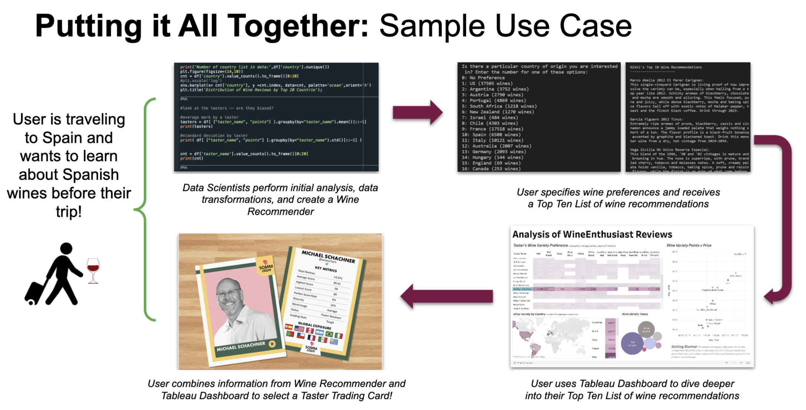

# CS5010-Final-Project
Final project for CS 5010: Python for Data Analysis
Bev Dobrenz (bgd5de), Joseph Wysocki (jw6mw), Amanda West (acw9gs), Nikki Aaron (na5zn)

- Paper: 1. Write-Up
- Powerpoint: 2. Powerpoint Slides

## File List
#
Original dataset: winemag-data-130k-v2.csv
Original grape Variety list (Wikipedia): grape_list.csv

## Data Processing
#
### Step 1: Parsing the grape list

- Parser script: grape_list_parser.py
- Output: grape_list_parsed.csv
- Unit test: grape_list_parser_test.py

### Step 2: Match wines with wine type (Red, White, Rosé, Sparkling, Blend)

- Matching script: grape_id.py
- Unit test: grape_id_test.py
- Output: wine.csv

### Step 3: Add Flavor Profile Tags

- NLP Practice: Text_Mining_Suite.ipynb
- Definitions: 3. NLP Definitions.pdf
- Test with One Paragraph Box: Desc_Test_1_Box.ipynb
- Original Categorizer Script: Add_Categories.ipynb
- Chunked Processing Categorizer Script: Add_Categories.py
- Output: wine2.csv

### Step 4: Wine Recommender Terminal Application

- Application Script: filters.py
- Sample Output: recommendations.txt

### Step 5: Tableau Dashboard

- Dashboard: https://public.tableau.com/profile/b.dobrenz#!/vizhome/CS5010FinalProject-AnalysisofWineEnthusiastReviews/WineVarietyEDA

